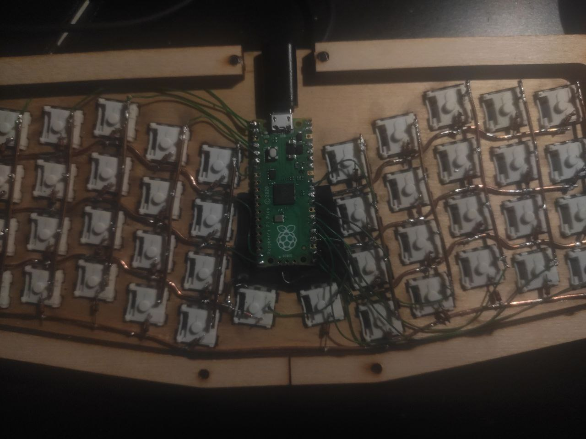
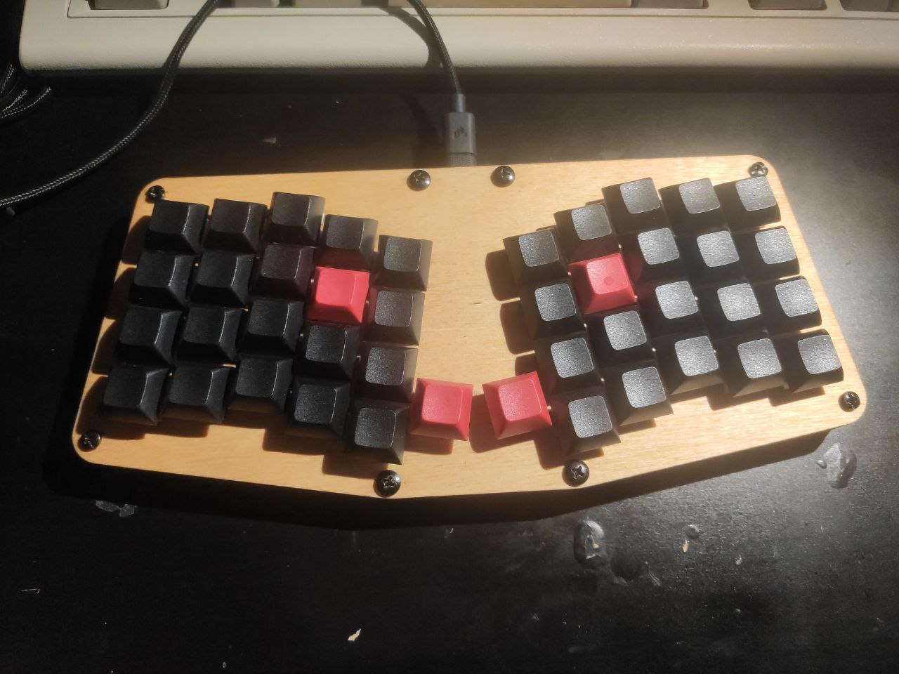

# Rentreus 42 (atreus 42) 

## Wiring

row1 = board.GP14 (top left)
row2 = board.GP15
row3 = board.GP17
row4 = board.GP16

col1 = board.GP19 (top left)
col2 = board.GP20
col3 = board.GP21
col4 = board.GP22
col5 = board.GP26
middle = board.GP18
col6 = board.GP4
col7 = board.GP3
col8 = board.GP2
col9 = board.GP1
col10 = board.GP0

## The software 

First of all you have to install circuit python on the Pi pico.
To do so, follow the instruction on [the adafruit site](https://learn.adafruit.com/getting-started-with-raspberry-pi-pico-circuitpython/circuitpython)

Next follow the [getting started guide by KMK team](https://github.com/KMKfw/kmk_firmware/blob/master/docs/Getting_Started.md)

Now you are ready to just copy the repo code and paste to the pico storage

## If you added extra cables to the row1 and col1
then you can uncomment the code in the [boot.py](./boot.py).

What the code does it hides a pico storage. You can still access.
To do so, connect the extra cables (row1 and col1) during boot and the storage should appear.

### Happy hacking

## Some pics

